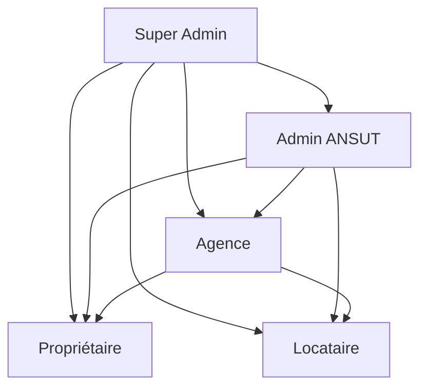

# Comptes Utilisateurs - Mon Toit

Ce document détaille les différents types de comptes utilisateurs disponibles dans le système Mon Toit, leurs rôles, permissions et fonctionnalités associées.

## 📋 Table des Matières

- [Types de Comptes](#types-de-comptes)
- [Hiérarchie des Permissions](#hiérarchie-des-permissions)
- [Comptes de Test](#comptes-de-test)
- [Processus de Création](#processus-de-création)
- [Sécurité et Authentification](#sécurité-et-authentification)

---

## 🏗️ Types de Comptes

### 1. **Locataire** (`locataire`)
**Description** : Utilisateur recherchant un logement à louer

**Fonctionnalités principales** :
- ✅ Recherche de biens immobiliers
- ✅ Sauvegarde des favoris
- ✅ Dépôt de candidatures de location
- ✅ Signature électronique des baux
- ✅ Paiement en ligne des loyers
- ✅ Messagerie avec propriétaires
- ✅ Gestion des documents personnels
- ✅ Vérification ANSUT

**Permissions** :
- Lecture : Tous les biens approuvés
- Écriture : Candidatures, messages, profil
- Limitations : Ne peut pas publier de biens

---

### 2. **Propriétaire Individuel** (`proprietaire`)
**Description** : Particulier possédant des biens à louer

**Fonctionnalités principales** :
- ✅ Publication et gestion de biens
- ✅ Gestion des candidatures
- ✅ Signature électronique des contrats
- ✅ Gestion des mandats
- ✅ Messagerie avec locataires
- ✅ Suivi des paiements
- ✅ Vérification ANSUT
- ✅ Tableau de bord personnel

**Permissions** :
- Lecture : Tous ses biens et candidatures
- Écriture : Biens, contrats, mandats, messages
- Avantages : Jusqu'à 10 biens gratuits

---

### 3. **Agence Immobilière** (`agence`)
**Description** : Professionnel gérant plusieurs biens pour des propriétaires

**Fonctionnalités principales** :
- ✅ Gestion multi-propriétaires
- ✅ Publication illimitée de biens
- ✅ Gestion avancée des mandats
- ✅ Tableau de bord analytique
- ✅ Gestion d'équipe (agents)
- ✅ Rapports et statistiques
- ✅ Certification ANSUT renforcée
- ✅ Marque blanche possible

**Permissions** :
- Lecture : Tous les biens gérés par l'agence
- Écriture : Biens, contrats, mandats, équipe
- Avantages : Outils analytiques avancés

---

### 4. **Administrateur ANSUT** (`admin`)
**Description** : Superviseur certifié par l'ANSUT pour la validation et modération

**Fonctionnalités principales** :
- ✅ Validation des certifications
- ✅ Modération des contenus
- ✅ Gestion des litiges
- ✅ Vérification des documents
- ✅ Audit du système
- ✅ Gestion des signalements
- ✅ Rapports de conformité
- ✅ Accès admin complet

**Permissions** :
- Lecture : Tout le système
- Écriture : Certifications, modération, configuration
- Responsabilités : Maintien de la qualité et conformité

---

### 5. **Super Administrateur** (`super_admin`)
**Description** : Administrateur système avec accès complet

**Fonctionnalités principales** :
- ✅ Gestion complète du système
- ✅ Configuration technique
- ✅ Gestion des utilisateurs et rôles
- ✅ Maintenance et monitoring
- ✅ Backup et restauration
- ✅ Intégrations API
- ✅ Personnalisation avancée

**Permissions** :
- Lecture : Tout le système et base de données
- Écriture : Tout le système sans restriction
- Responsabilités : Intégrité et performance du système

---

## 🏆 Hiérarchie des Permissions

**Niveaux d'accès** (du plus haut au plus bas) :
1. **Super Admin** : Accès système complet
2. **Admin ANSUT** : Modération et validation
3. **Agence** : Gestion multi-biens
4. **Propriétaire** : Gestion de biens personnels
5. **Locataire** : Utilisateur final

---

## 👥 Comptes de Test

### Comptes de Développement

| Type | Email | Mot de passe | Rôle | Utilisation |
|------|-------|-------------|------|------------|
| Locataire | `locataire@test.com` | `Test123!` | Locataire | Tests locataire |
| Propriétaire | `proprietaire1@test.com` | `Test123!` | Propriétaire | Tests propriétaire |
| Agence | `agence1@test.com` | `Test123!` | Agence | Tests agence |
| Admin | `admin@test.com` | `Admin123!` | Admin | Tests admin |
| Super Admin | `super@test.com` | `Super123!` | Super Admin | Tests système |

### Comptes de Démonstration

| Type | Email | Mot de passe | Description |
|------|-------|-------------|------------|
| Locataire | `demo@locataire.ci` | `Demo2025!` | Compte démonstration locataire |
| Propriétaire | `demo@proprietaire.ci` | `Demo2025!` | Compte démonstration propriétaire |
| Agence | `demo@agence.ci` | `Demo2025!` | Compte démonstration agence |

### Comptes de Staging

| Type | Email | Mot de passe | Environnement |
|------|-------|-------------|----------------|
| Locataire | `staging@locataire.ci` | `Staging2025!` | Staging |
| Propriétaire | `staging@proprietaire.ci` | `Staging2025!` | Staging |
| Agence | `staging@agence.ci` | `Staging2025!` | Staging |

---

## 🔄 Processus de Création

### 1. **Inscription Utilisateur**
1. Visiter `https://montoit.ci/auth`
2. Choisir le type de compte
3. Remplir le formulaire d'inscription
4. Vérifier l'email
5. Compléter le profil

### 2. **Vérification ANSUT**
1. Télécharger documents requis
2. Soumettre pour vérification
3. Attendre validation (24-48h)
4. Obtenir certification

### 3. **Activation Compte**
1. Connexion avec identifiants
2. Configuration initiale
3. Ajout de biens (propriétaire/agence)
4. Début d'utilisation

---

## 🔐 Sécurité et Authentification

### Méthodes d'Authentification
- **Email + Mot de passe** : Standard
- **Authentification à deux facteurs** : Recommandée
- **OAuth Google/Apple** : Optionnelle
- **Téléphone + OTP** : Disponible pour Côte d'Ivoire

### Politique de Mots de Passe
- **Longueur minimale** : 8 caractères
- **Complexité requise** : Majuscules, minuscules, chiffres, caractères spéciaux
- **Historique** : 5 derniers mots de passe interdits
- **Expiration** : 90 jours (recommandé)

### Sécurité des Comptes
- **Connexions multiples** : Maximum 3 simultanées
- **Alertes de sécurité** : Email pour activités suspectes
- **Blocage automatique** : Après 5 tentatives échouées
- **Audit des permissions** : Journal des actions administratives

---

## 📊 Statistiques par Type de Compte

### Distribution Typique
- **Locataires** : 70% des utilisateurs
- **Propriétaires** : 20% des utilisateurs
- **Agences** : 8% des utilisateurs
- **Admins** : 2% des utilisateurs

### Engagement Moyen
- **Locataires** : 15 visites/mois, 3 candidatures/mois
- **Propriétaires** : 5 biens gérés, 10 candidatures/mois
- **Agences** : 50 biens gérés, 100 candidatures/mois

---

## 🆘 Support Utilisateur

### Aide par Type de Compte
- **Locataire** : FAQ, chatbot, email, téléphone
- **Propriétaire** : Documentation, webinaires, support prioritaire
- **Agence** : Manager dédié, formation personnalisée
- **Admins** : Support technique direct, SLA garanti

### Ressources Disponibles
- **Guides vidéo** : Pour chaque type de compte
- **Documentation** : API, intégrations, bonnes pratiques
- **Webinaires** : Formation continue et nouveautés
- **Community** : Forum d'échange entre utilisateurs

---

## 📝 Notes de Version

### v2.0.0 (Actuelle)
- Ajout des comptes agence multi-propriétaires
- Amélioration des permissions granulaires
- Nouveau tableau de bord analytique

### v1.5.0
- Introduction des certifications ANSUT
- Amélioration de la messagerie
- Optimisation mobile

### v1.0.0
- Lancement initial avec locataires et propriétaires
- Système de base de recherche et candidatures

---

*Document maintenu par l'équipe Mon Toit - Dernière mise à jour : 17/10/2025*
